# Business Understanding

Being able to accurately predict the severity of cell tower faults would assist in directing limited repair/maintenance resources to geographically distant locations and proactively mitigate tower outages that can result in network downtime, lost revenues, and breaches in regulations that govern the telecom industry.

The goal of this project is to build a model that can predict fault_2 failures.

# Data Understanding

## Collect Data


```python
import pandas as pd
import numpy as np
from functools import reduce
import matplotlib.pyplot as plt
%matplotlib inline

event_type = pd.read_csv('event_type.csv')
log_feature = pd.read_csv('log_feature.csv')
resource_type = pd.read_csv('resource_type.csv')
severity_type = pd.read_csv('severity_type.csv')

csv_list = [event_type,log_feature,resource_type,severity_type]
```

Each feature in this dataset is stored in a separate CSV file and can be integrated by merging on the column 'id'


```python
df = reduce(lambda left,right: pd.merge(left,right,on='id'), csv_list)
```

The values in some columns are prepended by the name of the column and can be safely removed.


```python
df.head()
```


<div>
<style>
    .dataframe thead tr:only-child th {
        text-align: right;
    }

    .dataframe thead th {
        text-align: left;
    }

    .dataframe tbody tr th {
        vertical-align: top;
    }
</style>
<table border="1" class="dataframe">
  <thead>
    <tr style="text-align: right;">
      <th></th>
      <th>id</th>
      <th>event_type</th>
      <th>log_feature</th>
      <th>volume</th>
      <th>resource_type</th>
      <th>severity_type</th>
    </tr>
  </thead>
  <tbody>
    <tr>
      <th>0</th>
      <td>6597</td>
      <td>event_type 11</td>
      <td>feature 68</td>
      <td>6</td>
      <td>resource_type 8</td>
      <td>severity_type 2</td>
    </tr>
    <tr>
      <th>1</th>
      <td>8011</td>
      <td>event_type 15</td>
      <td>feature 68</td>
      <td>7</td>
      <td>resource_type 8</td>
      <td>severity_type 2</td>
    </tr>
    <tr>
      <th>2</th>
      <td>2597</td>
      <td>event_type 15</td>
      <td>feature 68</td>
      <td>1</td>
      <td>resource_type 8</td>
      <td>severity_type 2</td>
    </tr>
    <tr>
      <th>3</th>
      <td>5022</td>
      <td>event_type 15</td>
      <td>feature 172</td>
      <td>2</td>
      <td>resource_type 8</td>
      <td>severity_type 1</td>
    </tr>
    <tr>
      <th>4</th>
      <td>5022</td>
      <td>event_type 15</td>
      <td>feature 56</td>
      <td>1</td>
      <td>resource_type 8</td>
      <td>severity_type 1</td>
    </tr>
  </tbody>
</table>
</div>


```python
# str.extract uses a regex pattern to extract all numeric charcters
df.event_type = df.event_type.str.extract('(\d+)', expand=False)
df.log_feature = df.log_feature.str.extract('(\d+)', expand=False)
df.resource_type = df.resource_type.str.extract('(\d+)', expand=False)
df.severity_type = df.severity_type.str.extract('(\d+)', expand=False)
```


```python
train = pd.read_csv('train.csv')
train.head()
```


<div>
<style>
    .dataframe thead tr:only-child th {
        text-align: right;
    }

    .dataframe thead th {
        text-align: left;
    }

    .dataframe tbody tr th {
        vertical-align: top;
    }
</style>
<table border="1" class="dataframe">
  <thead>
    <tr style="text-align: right;">
      <th></th>
      <th>id</th>
      <th>location</th>
      <th>fault_severity</th>
    </tr>
  </thead>
  <tbody>
    <tr>
      <th>0</th>
      <td>14121</td>
      <td>location 118</td>
      <td>1</td>
    </tr>
    <tr>
      <th>1</th>
      <td>9320</td>
      <td>location 91</td>
      <td>0</td>
    </tr>
    <tr>
      <th>2</th>
      <td>14394</td>
      <td>location 152</td>
      <td>1</td>
    </tr>
    <tr>
      <th>3</th>
      <td>8218</td>
      <td>location 931</td>
      <td>1</td>
    </tr>
    <tr>
      <th>4</th>
      <td>14804</td>
      <td>location 120</td>
      <td>0</td>
    </tr>
  </tbody>
</table>
</div>


'train.csv' contains the index, another feature of the dataset 'location' which refers to a unique tower, and the target fault_severity for the unique location/timepoint id. 


```python
X = df.merge(train, on='id')
```

Extract only numbers from location


```python
X.location = X.location.str.extract('(\d+)', expand=False)
```


```python
## Describe Data
```


```python
X.shape
```


    (61839, 8)


```python
X.head()
```


<div>
<style>
    .dataframe thead tr:only-child th {
        text-align: right;
    }

    .dataframe thead th {
        text-align: left;
    }

    .dataframe tbody tr th {
        vertical-align: top;
    }
</style>
<table border="1" class="dataframe">
  <thead>
    <tr style="text-align: right;">
      <th></th>
      <th>id</th>
      <th>event_type</th>
      <th>log_feature</th>
      <th>volume</th>
      <th>resource_type</th>
      <th>severity_type</th>
      <th>location</th>
      <th>fault_severity</th>
    </tr>
  </thead>
  <tbody>
    <tr>
      <th>0</th>
      <td>8011</td>
      <td>15</td>
      <td>68</td>
      <td>7</td>
      <td>8</td>
      <td>2</td>
      <td>1</td>
      <td>0</td>
    </tr>
    <tr>
      <th>1</th>
      <td>2588</td>
      <td>15</td>
      <td>82</td>
      <td>9</td>
      <td>8</td>
      <td>1</td>
      <td>1</td>
      <td>0</td>
    </tr>
    <tr>
      <th>2</th>
      <td>2588</td>
      <td>15</td>
      <td>201</td>
      <td>5</td>
      <td>8</td>
      <td>1</td>
      <td>1</td>
      <td>0</td>
    </tr>
    <tr>
      <th>3</th>
      <td>2588</td>
      <td>15</td>
      <td>80</td>
      <td>15</td>
      <td>8</td>
      <td>1</td>
      <td>1</td>
      <td>0</td>
    </tr>
    <tr>
      <th>4</th>
      <td>2588</td>
      <td>15</td>
      <td>203</td>
      <td>5</td>
      <td>8</td>
      <td>1</td>
      <td>1</td>
      <td>0</td>
    </tr>
  </tbody>
</table>
</div>


Despite being filled with integers, the features in the dataset are all 'types' or 'features'.  This is categorical data, with the exception of 'volume' which is discrete interval variable

The 'id' field identifies a unique location-time point.  There are no timestamps to tell how far apart the fault observations are from each other and apparently no way to use one of the most useful metrics for making predications about product failures; Mean Time Between Failure.  Finding failure prone towers by location seems like it would be a good first place to look when exploring the data.


```python
train.fault_severity.value_counts()
```


    0    4784
    1    1871
    2     726
    Name: fault_severity, dtype: int64


There are a 7,381 fault severity labels that can be used to train a model.  

fault_severity (the target variable) should not be confused with severity_type (a categorical feature)


```python
X.severity_type.value_counts()
```


    1    36571
    2    24260
    4      920
    5       55
    3       33
    Name: severity_type, dtype: int64


```python
X.columns
```


    Index(['id', 'event_type', 'log_feature', 'volume', 'resource_type',
           'severity_type', 'location', 'fault_severity'],
          dtype='object')


### Exploring fault_severity frequency counts

###### Create a Dataframe with all location_id

929 unique location_ids


```python
locations = pd.DataFrame(X.location.unique())
locations.columns=['location']
```


```python
X[X.fault_severity==0].location.value_counts()
```


    794     1139
    126     1020
    124      784
    122      720
    242      654
    471      626
    102      571
    802      544
    495      526
    476      516
    496      447
    1095     444
    478      435
    821      407
    497      385
    893      379
    707      375
    91       370
    477      364
    734      362
    894      353
    494      347
    149      339
    469      301
    505      298
    691      293
    504      263
    484      251
    899      251
    466      250
            ... 
    273        1
    565        1
    901        1
    336        1
    807        1
    550        1
    1041       1
    1110       1
    719        1
    403        1
    1027       1
    110        1
    716        1
    788        1
    967        1
    928        1
    346        1
    713        1
    683        1
    511        1
    413        1
    869        1
    213        1
    419        1
    819        1
    487        1
    355        1
    865        1
    818        1
    429        1
    Name: location, Length: 808, dtype: int64


```python
fault_sev_0 = pd.DataFrame(X[X.fault_severity==0].location.value_counts())
fault_sev_0.columns = ['fault_0']
```


```python
fault_sev_0['location']=fault_sev_0.index
```


```python
fault_sev_0.head()
```


<div>
<style>
    .dataframe thead tr:only-child th {
        text-align: right;
    }

    .dataframe thead th {
        text-align: left;
    }

    .dataframe tbody tr th {
        vertical-align: top;
    }
</style>
<table border="1" class="dataframe">
  <thead>
    <tr style="text-align: right;">
      <th></th>
      <th>fault_0</th>
      <th>location</th>
    </tr>
  </thead>
  <tbody>
    <tr>
      <th>794</th>
      <td>1139</td>
      <td>794</td>
    </tr>
    <tr>
      <th>126</th>
      <td>1020</td>
      <td>126</td>
    </tr>
    <tr>
      <th>124</th>
      <td>784</td>
      <td>124</td>
    </tr>
    <tr>
      <th>122</th>
      <td>720</td>
      <td>122</td>
    </tr>
    <tr>
      <th>242</th>
      <td>654</td>
      <td>242</td>
    </tr>
  </tbody>
</table>
</div>


######  Count fault_severity of 1 for all locations


```python
fault_sev_1 = pd.DataFrame(X[X.fault_severity==1].location.value_counts())
fault_sev_1.columns = ['fault_1']
fault_sev_1['location']=fault_sev_1.index
```


```python
fault_sev_1.head()
```


<div>
<style>
    .dataframe thead tr:only-child th {
        text-align: right;
    }

    .dataframe thead th {
        text-align: left;
    }

    .dataframe tbody tr th {
        vertical-align: top;
    }
</style>
<table border="1" class="dataframe">
  <thead>
    <tr style="text-align: right;">
      <th></th>
      <th>fault_1</th>
      <th>location</th>
    </tr>
  </thead>
  <tbody>
    <tr>
      <th>821</th>
      <td>430</td>
      <td>821</td>
    </tr>
    <tr>
      <th>856</th>
      <td>378</td>
      <td>856</td>
    </tr>
    <tr>
      <th>661</th>
      <td>364</td>
      <td>661</td>
    </tr>
    <tr>
      <th>73</th>
      <td>341</td>
      <td>73</td>
    </tr>
    <tr>
      <th>627</th>
      <td>297</td>
      <td>627</td>
    </tr>
  </tbody>
</table>
</div>


```python
######  Count fault-severity of 2 for all locations
```


```python
fault_sev_2 = pd.DataFrame(X[X.fault_severity==2].location.value_counts())
fault_sev_2.columns = ['fault_2']
fault_sev_2['location']=fault_sev_2.index
```


```python
fault_sev_2.head()
```


<div>
<style>
    .dataframe thead tr:only-child th {
        text-align: right;
    }

    .dataframe thead th {
        text-align: left;
    }

    .dataframe tbody tr th {
        vertical-align: top;
    }
</style>
<table border="1" class="dataframe">
  <thead>
    <tr style="text-align: right;">
      <th></th>
      <th>fault_2</th>
      <th>location</th>
    </tr>
  </thead>
  <tbody>
    <tr>
      <th>13</th>
      <td>506</td>
      <td>13</td>
    </tr>
    <tr>
      <th>734</th>
      <td>450</td>
      <td>734</td>
    </tr>
    <tr>
      <th>745</th>
      <td>403</td>
      <td>745</td>
    </tr>
    <tr>
      <th>821</th>
      <td>353</td>
      <td>821</td>
    </tr>
    <tr>
      <th>1107</th>
      <td>314</td>
      <td>1107</td>
    </tr>
  </tbody>
</table>
</div>


```python
fault_list = [locations,fault_sev_0,fault_sev_1,fault_sev_2]
```


```python
# pd.merge defaults to inner merges (how='inner').  This means that only locations with fault_0, fault_1, fault_2 will be included in the resulting dataframe

# Specify how='outer' merge here ensures that if a location is missing any of the fault severities it will still be included 
#  in the resulting dataframe but display a 'NaN' which can you see in the dataframe head below
faults_by_location = reduce(lambda left,right: pd.merge(left,right,on='location', how='outer'), fault_list)
faults_by_location.head()
```


<div>
<style>
    .dataframe thead tr:only-child th {
        text-align: right;
    }

    .dataframe thead th {
        text-align: left;
    }

    .dataframe tbody tr th {
        vertical-align: top;
    }
</style>
<table border="1" class="dataframe">
  <thead>
    <tr style="text-align: right;">
      <th></th>
      <th>location</th>
      <th>fault_0</th>
      <th>fault_1</th>
      <th>fault_2</th>
    </tr>
  </thead>
  <tbody>
    <tr>
      <th>0</th>
      <td>1</td>
      <td>83.0</td>
      <td>66.0</td>
      <td>14.0</td>
    </tr>
    <tr>
      <th>1</th>
      <td>10</td>
      <td>2.0</td>
      <td>NaN</td>
      <td>NaN</td>
    </tr>
    <tr>
      <th>2</th>
      <td>100</td>
      <td>91.0</td>
      <td>5.0</td>
      <td>NaN</td>
    </tr>
    <tr>
      <th>3</th>
      <td>1000</td>
      <td>29.0</td>
      <td>NaN</td>
      <td>NaN</td>
    </tr>
    <tr>
      <th>4</th>
      <td>1002</td>
      <td>2.0</td>
      <td>NaN</td>
      <td>NaN</td>
    </tr>
  </tbody>
</table>
</div>


```python
faults_by_location.shape
```


    (929, 4)


```python
faults_by_location.fillna(0, inplace=True)
```

######  Create fault_total field


```python
faults_by_location['fault_total']= faults_by_location.fault_0 + faults_by_location.fault_1 + faults_by_location.fault_2
```


```python
faults_by_location.head()
```


<div>
<style>
    .dataframe thead tr:only-child th {
        text-align: right;
    }

    .dataframe thead th {
        text-align: left;
    }

    .dataframe tbody tr th {
        vertical-align: top;
    }
</style>
<table border="1" class="dataframe">
  <thead>
    <tr style="text-align: right;">
      <th></th>
      <th>location</th>
      <th>fault_0</th>
      <th>fault_1</th>
      <th>fault_2</th>
      <th>fault_total</th>
    </tr>
  </thead>
  <tbody>
    <tr>
      <th>0</th>
      <td>1</td>
      <td>83.0</td>
      <td>66.0</td>
      <td>14.0</td>
      <td>163.0</td>
    </tr>
    <tr>
      <th>1</th>
      <td>10</td>
      <td>2.0</td>
      <td>0.0</td>
      <td>0.0</td>
      <td>2.0</td>
    </tr>
    <tr>
      <th>2</th>
      <td>100</td>
      <td>91.0</td>
      <td>5.0</td>
      <td>0.0</td>
      <td>96.0</td>
    </tr>
    <tr>
      <th>3</th>
      <td>1000</td>
      <td>29.0</td>
      <td>0.0</td>
      <td>0.0</td>
      <td>29.0</td>
    </tr>
    <tr>
      <th>4</th>
      <td>1002</td>
      <td>2.0</td>
      <td>0.0</td>
      <td>0.0</td>
      <td>2.0</td>
    </tr>
  </tbody>
</table>
</div>


```python
faults_by_location.fault_total.hist(bins=50)
```


    <matplotlib.axes._subplots.AxesSubplot at 0x7f0823337080>


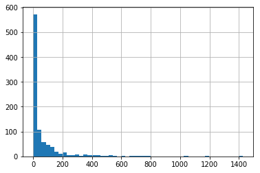


The heavy positive skew on this distribution shows that vast majority of tower locations make few recordings.


```python
faults_by_location.fault_total.max()
```


    1425.0


```python
faults_by_location[['fault_0','fault_1','fault_2']].plot(kind='bar', stacked=True, figsize=(12,6))
```


    <matplotlib.axes._subplots.AxesSubplot at 0x7f081bc3aa20>


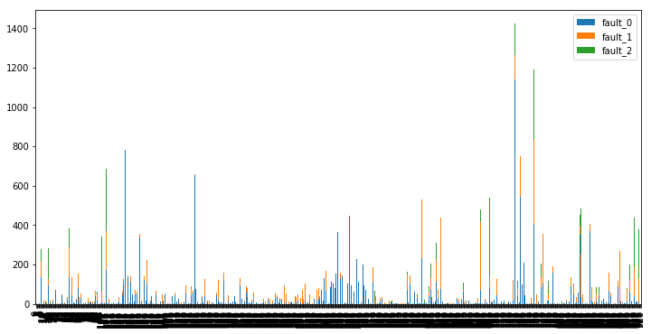


###### Sort plot by total faults in descending order


```python
sorted_faults_by_location = faults_by_location.sort_values('fault_total', axis=0, ascending=False)
```


```python
sorted_faults_by_location[['fault_0','fault_1','fault_2']].plot(kind='bar', stacked=True, figsize=(12,6))
```


    <matplotlib.axes._subplots.AxesSubplot at 0x7f0819908cc0>


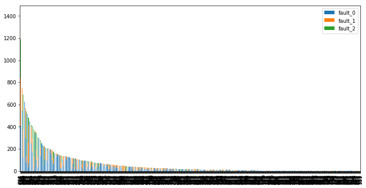


The plot above mimics the histogram of total_faults by location above, but attempts to visualize the category of each fault reading.
Perhaps creating a smaller of subset would help.


```python
sorted_faults_by_location.fault_total.describe()
```


    count     929.000000
    mean       66.565124
    std       135.806841
    min         1.000000
    25%         4.000000
    50%        17.000000
    75%        64.000000
    max      1425.000000
    Name: fault_total, dtype: float64


Its possible to zoom in on a specific subset and see if certain 'fault_types' are more prevelant at towers that log a similar number of features


```python
total_fault_upper_limit = 4
total_fault_lower_limit = 1
```


```python
index_subset = ((sorted_faults_by_location.fault_total<= total_fault_upper_limit) & (sorted_faults_by_location.fault_total>=total_fault_lower_limit))
```


```python
sorted_faults_by_location.loc[index_subset,['fault_0','fault_1','fault_2']].plot(kind='bar', stacked=True, figsize=(12,6), width=0.8)
```


    <matplotlib.axes._subplots.AxesSubplot at 0x7f081b7c4fd0>


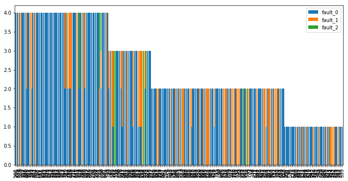


Possible future areas of exploration are:
1. Identifying location_id's with a high number of fault_1 and fault_2 counts
1. Identifying location_id's with a high percentage of fault_1 or 2 of the total number of faults

### Prepping Volume, the only discrete interval variable

Only 'volume' is a non-categorical variable

Volume shows heavy positive skew


```python
X.volume.hist(bins=50)
```


    <matplotlib.axes._subplots.AxesSubplot at 0x7f0819119978>


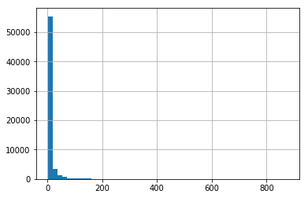


```python
np.log(X.volume).hist(bins=50)
```


    <matplotlib.axes._subplots.AxesSubplot at 0x7f0817c44ac8>


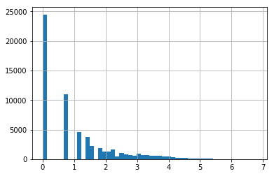


```python
volume_log = np.log(X.volume)
```


```python
X['volume_log']=np.ceil(volume_log)
```


```python
X.drop('volume', axis=1, inplace=True)
```

There is a large positive skew in log_volume.  Decision Trees are not hindered by skewed data and would be a decent place to start

# Data Preparation


```python
import pandas as pd
import numpy as np
from functools import reduce
import math

from sklearn.model_selection import GridSearchCV
from sklearn.model_selection import cross_val_score #,  cross_validate
from sklearn.ensemble import GradientBoostingClassifier
from sklearn import metrics

import matplotlib.pylab as plt
%matplotlib inline
```


```python
event_type = pd.read_csv('event_type.csv')
log_feature = pd.read_csv('log_feature.csv')
resource_type = pd.read_csv('resource_type.csv')
severity_type = pd.read_csv('severity_type.csv')
train = pd.read_csv('train.csv')

csv_list = [event_type,log_feature,resource_type,severity_type,train]
```

######  Merge datasets on ID


```python
# This is an inner join by default and will only include IDs that are present in all dataframes (the intersection of all data files)
# This is ok, because the model should only be trained on ID's present in the train dataset.  There are 7381 unique IDs in the train dataset
df = reduce(lambda left,right: pd.merge(left,right,on='id'), csv_list)
```

###### Remove all non-numeric characters


```python
# str.extract uses regex pattern to extract all numeric charcters
df.event_type = df.event_type.str.extract('(\d+)',expand=False)
df.log_feature = df.log_feature.str.extract('(\d+)',expand=False)
df.resource_type = df.resource_type.str.extract('(\d+)',expand=False)
df.severity_type = df.severity_type.str.extract('(\d+)',expand=False)
df.location = df.location.str.extract('(\d+)',expand=False)
```


```python
df.head()
```


<div>
<style>
    .dataframe thead tr:only-child th {
        text-align: right;
    }

    .dataframe thead th {
        text-align: left;
    }

    .dataframe tbody tr th {
        vertical-align: top;
    }
</style>
<table border="1" class="dataframe">
  <thead>
    <tr style="text-align: right;">
      <th></th>
      <th>id</th>
      <th>event_type</th>
      <th>log_feature</th>
      <th>volume</th>
      <th>resource_type</th>
      <th>severity_type</th>
      <th>location</th>
      <th>fault_severity</th>
    </tr>
  </thead>
  <tbody>
    <tr>
      <th>0</th>
      <td>8011</td>
      <td>15</td>
      <td>68</td>
      <td>7</td>
      <td>8</td>
      <td>2</td>
      <td>1</td>
      <td>0</td>
    </tr>
    <tr>
      <th>1</th>
      <td>2588</td>
      <td>15</td>
      <td>82</td>
      <td>9</td>
      <td>8</td>
      <td>1</td>
      <td>1</td>
      <td>0</td>
    </tr>
    <tr>
      <th>2</th>
      <td>2588</td>
      <td>15</td>
      <td>201</td>
      <td>5</td>
      <td>8</td>
      <td>1</td>
      <td>1</td>
      <td>0</td>
    </tr>
    <tr>
      <th>3</th>
      <td>2588</td>
      <td>15</td>
      <td>80</td>
      <td>15</td>
      <td>8</td>
      <td>1</td>
      <td>1</td>
      <td>0</td>
    </tr>
    <tr>
      <th>4</th>
      <td>2588</td>
      <td>15</td>
      <td>203</td>
      <td>5</td>
      <td>8</td>
      <td>1</td>
      <td>1</td>
      <td>0</td>
    </tr>
  </tbody>
</table>
</div>


```python
X = df.drop('fault_severity', axis=1)
```


```python
y = df[['id','fault_severity']]
```

Verify that there are the same number of unique IDs in both X and y


```python
y.id.nunique()
```


    7381


```python
X.id.nunique()
```


    7381


###### 'id' and 'volume' are ints.  The rest are categorical according to the data dictionary.  X is ready to be changed into dummy columns using pd.getdummies()


```python
X.info()
```

    <class 'pandas.core.frame.DataFrame'>
    Int64Index: 61839 entries, 0 to 61838
    Data columns (total 7 columns):
    id               61839 non-null int64
    event_type       61839 non-null object
    log_feature      61839 non-null object
    volume           61839 non-null int64
    resource_type    61839 non-null object
    severity_type    61839 non-null object
    location         61839 non-null object
    dtypes: int64(2), object(5)
    memory usage: 3.8+ MB


```python
X = pd.get_dummies(X)
```


```python
X.columns
```


    Index(['id', 'volume', 'event_type_1', 'event_type_10', 'event_type_11',
           'event_type_12', 'event_type_13', 'event_type_14', 'event_type_15',
           'event_type_18',
           ...
           'location_987', 'location_989', 'location_99', 'location_990',
           'location_991', 'location_994', 'location_995', 'location_996',
           'location_998', 'location_999'],
          dtype='object', length=1326)


Check that the get_dummies() worked as expected


```python
X.head()
```


<div>
<style>
    .dataframe thead tr:only-child th {
        text-align: right;
    }

    .dataframe thead th {
        text-align: left;
    }

    .dataframe tbody tr th {
        vertical-align: top;
    }
</style>
<table border="1" class="dataframe">
  <thead>
    <tr style="text-align: right;">
      <th></th>
      <th>id</th>
      <th>volume</th>
      <th>event_type_1</th>
      <th>event_type_10</th>
      <th>event_type_11</th>
      <th>event_type_12</th>
      <th>event_type_13</th>
      <th>event_type_14</th>
      <th>event_type_15</th>
      <th>event_type_18</th>
      <th>...</th>
      <th>location_987</th>
      <th>location_989</th>
      <th>location_99</th>
      <th>location_990</th>
      <th>location_991</th>
      <th>location_994</th>
      <th>location_995</th>
      <th>location_996</th>
      <th>location_998</th>
      <th>location_999</th>
    </tr>
  </thead>
  <tbody>
    <tr>
      <th>0</th>
      <td>8011</td>
      <td>7</td>
      <td>0</td>
      <td>0</td>
      <td>0</td>
      <td>0</td>
      <td>0</td>
      <td>0</td>
      <td>1</td>
      <td>0</td>
      <td>...</td>
      <td>0</td>
      <td>0</td>
      <td>0</td>
      <td>0</td>
      <td>0</td>
      <td>0</td>
      <td>0</td>
      <td>0</td>
      <td>0</td>
      <td>0</td>
    </tr>
    <tr>
      <th>1</th>
      <td>2588</td>
      <td>9</td>
      <td>0</td>
      <td>0</td>
      <td>0</td>
      <td>0</td>
      <td>0</td>
      <td>0</td>
      <td>1</td>
      <td>0</td>
      <td>...</td>
      <td>0</td>
      <td>0</td>
      <td>0</td>
      <td>0</td>
      <td>0</td>
      <td>0</td>
      <td>0</td>
      <td>0</td>
      <td>0</td>
      <td>0</td>
    </tr>
    <tr>
      <th>2</th>
      <td>2588</td>
      <td>5</td>
      <td>0</td>
      <td>0</td>
      <td>0</td>
      <td>0</td>
      <td>0</td>
      <td>0</td>
      <td>1</td>
      <td>0</td>
      <td>...</td>
      <td>0</td>
      <td>0</td>
      <td>0</td>
      <td>0</td>
      <td>0</td>
      <td>0</td>
      <td>0</td>
      <td>0</td>
      <td>0</td>
      <td>0</td>
    </tr>
    <tr>
      <th>3</th>
      <td>2588</td>
      <td>15</td>
      <td>0</td>
      <td>0</td>
      <td>0</td>
      <td>0</td>
      <td>0</td>
      <td>0</td>
      <td>1</td>
      <td>0</td>
      <td>...</td>
      <td>0</td>
      <td>0</td>
      <td>0</td>
      <td>0</td>
      <td>0</td>
      <td>0</td>
      <td>0</td>
      <td>0</td>
      <td>0</td>
      <td>0</td>
    </tr>
    <tr>
      <th>4</th>
      <td>2588</td>
      <td>5</td>
      <td>0</td>
      <td>0</td>
      <td>0</td>
      <td>0</td>
      <td>0</td>
      <td>0</td>
      <td>1</td>
      <td>0</td>
      <td>...</td>
      <td>0</td>
      <td>0</td>
      <td>0</td>
      <td>0</td>
      <td>0</td>
      <td>0</td>
      <td>0</td>
      <td>0</td>
      <td>0</td>
      <td>0</td>
    </tr>
  </tbody>
</table>
<p>5 rows × 1326 columns</p>
</div>


There are multiple IDs with different combinations of features.  Combine the features with a grouby().max().  


```python
X = X.groupby('id').max()
```

Check that the groupby worked as expected.  There should be no dummy variables with values != 0 or 1


```python
X.head()
```


<div>
<style>
    .dataframe thead tr:only-child th {
        text-align: right;
    }

    .dataframe thead th {
        text-align: left;
    }

    .dataframe tbody tr th {
        vertical-align: top;
    }
</style>
<table border="1" class="dataframe">
  <thead>
    <tr style="text-align: right;">
      <th></th>
      <th>volume</th>
      <th>event_type_1</th>
      <th>event_type_10</th>
      <th>event_type_11</th>
      <th>event_type_12</th>
      <th>event_type_13</th>
      <th>event_type_14</th>
      <th>event_type_15</th>
      <th>event_type_18</th>
      <th>event_type_19</th>
      <th>...</th>
      <th>location_987</th>
      <th>location_989</th>
      <th>location_99</th>
      <th>location_990</th>
      <th>location_991</th>
      <th>location_994</th>
      <th>location_995</th>
      <th>location_996</th>
      <th>location_998</th>
      <th>location_999</th>
    </tr>
    <tr>
      <th>id</th>
      <th></th>
      <th></th>
      <th></th>
      <th></th>
      <th></th>
      <th></th>
      <th></th>
      <th></th>
      <th></th>
      <th></th>
      <th></th>
      <th></th>
      <th></th>
      <th></th>
      <th></th>
      <th></th>
      <th></th>
      <th></th>
      <th></th>
      <th></th>
      <th></th>
    </tr>
  </thead>
  <tbody>
    <tr>
      <th>1</th>
      <td>2</td>
      <td>0</td>
      <td>0</td>
      <td>1</td>
      <td>0</td>
      <td>1</td>
      <td>0</td>
      <td>0</td>
      <td>0</td>
      <td>0</td>
      <td>...</td>
      <td>0</td>
      <td>0</td>
      <td>0</td>
      <td>0</td>
      <td>0</td>
      <td>0</td>
      <td>0</td>
      <td>0</td>
      <td>0</td>
      <td>0</td>
    </tr>
    <tr>
      <th>5</th>
      <td>11</td>
      <td>0</td>
      <td>0</td>
      <td>0</td>
      <td>0</td>
      <td>0</td>
      <td>0</td>
      <td>0</td>
      <td>0</td>
      <td>0</td>
      <td>...</td>
      <td>0</td>
      <td>0</td>
      <td>0</td>
      <td>0</td>
      <td>0</td>
      <td>0</td>
      <td>0</td>
      <td>0</td>
      <td>0</td>
      <td>0</td>
    </tr>
    <tr>
      <th>6</th>
      <td>1</td>
      <td>0</td>
      <td>0</td>
      <td>0</td>
      <td>0</td>
      <td>0</td>
      <td>0</td>
      <td>0</td>
      <td>0</td>
      <td>0</td>
      <td>...</td>
      <td>0</td>
      <td>0</td>
      <td>0</td>
      <td>0</td>
      <td>0</td>
      <td>0</td>
      <td>0</td>
      <td>0</td>
      <td>0</td>
      <td>0</td>
    </tr>
    <tr>
      <th>8</th>
      <td>5</td>
      <td>0</td>
      <td>0</td>
      <td>0</td>
      <td>0</td>
      <td>0</td>
      <td>0</td>
      <td>0</td>
      <td>0</td>
      <td>0</td>
      <td>...</td>
      <td>0</td>
      <td>0</td>
      <td>0</td>
      <td>0</td>
      <td>0</td>
      <td>0</td>
      <td>0</td>
      <td>0</td>
      <td>0</td>
      <td>0</td>
    </tr>
    <tr>
      <th>13</th>
      <td>1</td>
      <td>0</td>
      <td>0</td>
      <td>0</td>
      <td>0</td>
      <td>0</td>
      <td>0</td>
      <td>0</td>
      <td>0</td>
      <td>0</td>
      <td>...</td>
      <td>0</td>
      <td>0</td>
      <td>0</td>
      <td>0</td>
      <td>0</td>
      <td>0</td>
      <td>0</td>
      <td>0</td>
      <td>0</td>
      <td>0</td>
    </tr>
  </tbody>
</table>
<p>5 rows × 1325 columns</p>
</div>


```python
X['id'] = X.index
```


```python
X.head()
```


<div>
<style>
    .dataframe thead tr:only-child th {
        text-align: right;
    }

    .dataframe thead th {
        text-align: left;
    }

    .dataframe tbody tr th {
        vertical-align: top;
    }
</style>
<table border="1" class="dataframe">
  <thead>
    <tr style="text-align: right;">
      <th></th>
      <th>volume</th>
      <th>event_type_1</th>
      <th>event_type_10</th>
      <th>event_type_11</th>
      <th>event_type_12</th>
      <th>event_type_13</th>
      <th>event_type_14</th>
      <th>event_type_15</th>
      <th>event_type_18</th>
      <th>event_type_19</th>
      <th>...</th>
      <th>location_989</th>
      <th>location_99</th>
      <th>location_990</th>
      <th>location_991</th>
      <th>location_994</th>
      <th>location_995</th>
      <th>location_996</th>
      <th>location_998</th>
      <th>location_999</th>
      <th>id</th>
    </tr>
    <tr>
      <th>id</th>
      <th></th>
      <th></th>
      <th></th>
      <th></th>
      <th></th>
      <th></th>
      <th></th>
      <th></th>
      <th></th>
      <th></th>
      <th></th>
      <th></th>
      <th></th>
      <th></th>
      <th></th>
      <th></th>
      <th></th>
      <th></th>
      <th></th>
      <th></th>
      <th></th>
    </tr>
  </thead>
  <tbody>
    <tr>
      <th>1</th>
      <td>2</td>
      <td>0</td>
      <td>0</td>
      <td>1</td>
      <td>0</td>
      <td>1</td>
      <td>0</td>
      <td>0</td>
      <td>0</td>
      <td>0</td>
      <td>...</td>
      <td>0</td>
      <td>0</td>
      <td>0</td>
      <td>0</td>
      <td>0</td>
      <td>0</td>
      <td>0</td>
      <td>0</td>
      <td>0</td>
      <td>1</td>
    </tr>
    <tr>
      <th>5</th>
      <td>11</td>
      <td>0</td>
      <td>0</td>
      <td>0</td>
      <td>0</td>
      <td>0</td>
      <td>0</td>
      <td>0</td>
      <td>0</td>
      <td>0</td>
      <td>...</td>
      <td>0</td>
      <td>0</td>
      <td>0</td>
      <td>0</td>
      <td>0</td>
      <td>0</td>
      <td>0</td>
      <td>0</td>
      <td>0</td>
      <td>5</td>
    </tr>
    <tr>
      <th>6</th>
      <td>1</td>
      <td>0</td>
      <td>0</td>
      <td>0</td>
      <td>0</td>
      <td>0</td>
      <td>0</td>
      <td>0</td>
      <td>0</td>
      <td>0</td>
      <td>...</td>
      <td>0</td>
      <td>0</td>
      <td>0</td>
      <td>0</td>
      <td>0</td>
      <td>0</td>
      <td>0</td>
      <td>0</td>
      <td>0</td>
      <td>6</td>
    </tr>
    <tr>
      <th>8</th>
      <td>5</td>
      <td>0</td>
      <td>0</td>
      <td>0</td>
      <td>0</td>
      <td>0</td>
      <td>0</td>
      <td>0</td>
      <td>0</td>
      <td>0</td>
      <td>...</td>
      <td>0</td>
      <td>0</td>
      <td>0</td>
      <td>0</td>
      <td>0</td>
      <td>0</td>
      <td>0</td>
      <td>0</td>
      <td>0</td>
      <td>8</td>
    </tr>
    <tr>
      <th>13</th>
      <td>1</td>
      <td>0</td>
      <td>0</td>
      <td>0</td>
      <td>0</td>
      <td>0</td>
      <td>0</td>
      <td>0</td>
      <td>0</td>
      <td>0</td>
      <td>...</td>
      <td>0</td>
      <td>0</td>
      <td>0</td>
      <td>0</td>
      <td>0</td>
      <td>0</td>
      <td>0</td>
      <td>0</td>
      <td>0</td>
      <td>13</td>
    </tr>
  </tbody>
</table>
<p>5 rows × 1326 columns</p>
</div>


Modifying 'volume' field had no significant effect on the results


```python
X.volume = X.volume/X.volume.max()

X.head()
```


<div>
<style>
    .dataframe thead tr:only-child th {
        text-align: right;
    }

    .dataframe thead th {
        text-align: left;
    }

    .dataframe tbody tr th {
        vertical-align: top;
    }
</style>
<table border="1" class="dataframe">
  <thead>
    <tr style="text-align: right;">
      <th></th>
      <th>volume</th>
      <th>event_type_1</th>
      <th>event_type_10</th>
      <th>event_type_11</th>
      <th>event_type_12</th>
      <th>event_type_13</th>
      <th>event_type_14</th>
      <th>event_type_15</th>
      <th>event_type_18</th>
      <th>event_type_19</th>
      <th>...</th>
      <th>location_989</th>
      <th>location_99</th>
      <th>location_990</th>
      <th>location_991</th>
      <th>location_994</th>
      <th>location_995</th>
      <th>location_996</th>
      <th>location_998</th>
      <th>location_999</th>
      <th>id</th>
    </tr>
    <tr>
      <th>id</th>
      <th></th>
      <th></th>
      <th></th>
      <th></th>
      <th></th>
      <th></th>
      <th></th>
      <th></th>
      <th></th>
      <th></th>
      <th></th>
      <th></th>
      <th></th>
      <th></th>
      <th></th>
      <th></th>
      <th></th>
      <th></th>
      <th></th>
      <th></th>
      <th></th>
    </tr>
  </thead>
  <tbody>
    <tr>
      <th>1</th>
      <td>0.002281</td>
      <td>0</td>
      <td>0</td>
      <td>1</td>
      <td>0</td>
      <td>1</td>
      <td>0</td>
      <td>0</td>
      <td>0</td>
      <td>0</td>
      <td>...</td>
      <td>0</td>
      <td>0</td>
      <td>0</td>
      <td>0</td>
      <td>0</td>
      <td>0</td>
      <td>0</td>
      <td>0</td>
      <td>0</td>
      <td>1</td>
    </tr>
    <tr>
      <th>5</th>
      <td>0.012543</td>
      <td>0</td>
      <td>0</td>
      <td>0</td>
      <td>0</td>
      <td>0</td>
      <td>0</td>
      <td>0</td>
      <td>0</td>
      <td>0</td>
      <td>...</td>
      <td>0</td>
      <td>0</td>
      <td>0</td>
      <td>0</td>
      <td>0</td>
      <td>0</td>
      <td>0</td>
      <td>0</td>
      <td>0</td>
      <td>5</td>
    </tr>
    <tr>
      <th>6</th>
      <td>0.001140</td>
      <td>0</td>
      <td>0</td>
      <td>0</td>
      <td>0</td>
      <td>0</td>
      <td>0</td>
      <td>0</td>
      <td>0</td>
      <td>0</td>
      <td>...</td>
      <td>0</td>
      <td>0</td>
      <td>0</td>
      <td>0</td>
      <td>0</td>
      <td>0</td>
      <td>0</td>
      <td>0</td>
      <td>0</td>
      <td>6</td>
    </tr>
    <tr>
      <th>8</th>
      <td>0.005701</td>
      <td>0</td>
      <td>0</td>
      <td>0</td>
      <td>0</td>
      <td>0</td>
      <td>0</td>
      <td>0</td>
      <td>0</td>
      <td>0</td>
      <td>...</td>
      <td>0</td>
      <td>0</td>
      <td>0</td>
      <td>0</td>
      <td>0</td>
      <td>0</td>
      <td>0</td>
      <td>0</td>
      <td>0</td>
      <td>8</td>
    </tr>
    <tr>
      <th>13</th>
      <td>0.001140</td>
      <td>0</td>
      <td>0</td>
      <td>0</td>
      <td>0</td>
      <td>0</td>
      <td>0</td>
      <td>0</td>
      <td>0</td>
      <td>0</td>
      <td>...</td>
      <td>0</td>
      <td>0</td>
      <td>0</td>
      <td>0</td>
      <td>0</td>
      <td>0</td>
      <td>0</td>
      <td>0</td>
      <td>0</td>
      <td>13</td>
    </tr>
  </tbody>
</table>
<p>5 rows × 1326 columns</p>
</div>


# Data Modeling


```python
# dtrain includes X and y column
dtrain = X[:]
target = 'fault_severity'
predictors = [x for x in X.columns if x not in [target, 'id']]
```


```python
len(dtrain)
```


    7381


```python
len(y)
```


    61839


```python
dtrain[target]= y.groupby('id').max()
```

    A value is trying to be set on a copy of a slice from a DataFrame.
    Try using .loc[row_indexer,col_indexer] = value instead
    
    See the caveats in the documentation: http://pandas.pydata.org/pandas-docs/stable/indexing.html#indexing-view-versus-copy
      """Entry point for launching an IPython kernel.


```python
dtrain.head()
```


<div>
<style>
    .dataframe thead tr:only-child th {
        text-align: right;
    }

    .dataframe thead th {
        text-align: left;
    }

    .dataframe tbody tr th {
        vertical-align: top;
    }
</style>
<table border="1" class="dataframe">
  <thead>
    <tr style="text-align: right;">
      <th></th>
      <th>volume</th>
      <th>event_type_1</th>
      <th>event_type_10</th>
      <th>event_type_11</th>
      <th>event_type_12</th>
      <th>event_type_13</th>
      <th>event_type_14</th>
      <th>event_type_15</th>
      <th>event_type_18</th>
      <th>event_type_19</th>
      <th>...</th>
      <th>location_99</th>
      <th>location_990</th>
      <th>location_991</th>
      <th>location_994</th>
      <th>location_995</th>
      <th>location_996</th>
      <th>location_998</th>
      <th>location_999</th>
      <th>id</th>
      <th>fault_severity</th>
    </tr>
    <tr>
      <th>id</th>
      <th></th>
      <th></th>
      <th></th>
      <th></th>
      <th></th>
      <th></th>
      <th></th>
      <th></th>
      <th></th>
      <th></th>
      <th></th>
      <th></th>
      <th></th>
      <th></th>
      <th></th>
      <th></th>
      <th></th>
      <th></th>
      <th></th>
      <th></th>
      <th></th>
    </tr>
  </thead>
  <tbody>
    <tr>
      <th>1</th>
      <td>0.002281</td>
      <td>0</td>
      <td>0</td>
      <td>1</td>
      <td>0</td>
      <td>1</td>
      <td>0</td>
      <td>0</td>
      <td>0</td>
      <td>0</td>
      <td>...</td>
      <td>0</td>
      <td>0</td>
      <td>0</td>
      <td>0</td>
      <td>0</td>
      <td>0</td>
      <td>0</td>
      <td>0</td>
      <td>1</td>
      <td>1</td>
    </tr>
    <tr>
      <th>5</th>
      <td>0.012543</td>
      <td>0</td>
      <td>0</td>
      <td>0</td>
      <td>0</td>
      <td>0</td>
      <td>0</td>
      <td>0</td>
      <td>0</td>
      <td>0</td>
      <td>...</td>
      <td>0</td>
      <td>0</td>
      <td>0</td>
      <td>0</td>
      <td>0</td>
      <td>0</td>
      <td>0</td>
      <td>0</td>
      <td>5</td>
      <td>0</td>
    </tr>
    <tr>
      <th>6</th>
      <td>0.001140</td>
      <td>0</td>
      <td>0</td>
      <td>0</td>
      <td>0</td>
      <td>0</td>
      <td>0</td>
      <td>0</td>
      <td>0</td>
      <td>0</td>
      <td>...</td>
      <td>0</td>
      <td>0</td>
      <td>0</td>
      <td>0</td>
      <td>0</td>
      <td>0</td>
      <td>0</td>
      <td>0</td>
      <td>6</td>
      <td>1</td>
    </tr>
    <tr>
      <th>8</th>
      <td>0.005701</td>
      <td>0</td>
      <td>0</td>
      <td>0</td>
      <td>0</td>
      <td>0</td>
      <td>0</td>
      <td>0</td>
      <td>0</td>
      <td>0</td>
      <td>...</td>
      <td>0</td>
      <td>0</td>
      <td>0</td>
      <td>0</td>
      <td>0</td>
      <td>0</td>
      <td>0</td>
      <td>0</td>
      <td>8</td>
      <td>0</td>
    </tr>
    <tr>
      <th>13</th>
      <td>0.001140</td>
      <td>0</td>
      <td>0</td>
      <td>0</td>
      <td>0</td>
      <td>0</td>
      <td>0</td>
      <td>0</td>
      <td>0</td>
      <td>0</td>
      <td>...</td>
      <td>0</td>
      <td>0</td>
      <td>0</td>
      <td>0</td>
      <td>0</td>
      <td>0</td>
      <td>0</td>
      <td>0</td>
      <td>13</td>
      <td>0</td>
    </tr>
  </tbody>
</table>
<p>5 rows × 1327 columns</p>
</div>


```python
dtrain.to_csv('pbl0_cleaned.csv')
```


```python
dtrain[target]
```


    id
    1        1
    5        0
    6        1
    8        0
    13       0
    19       1
    20       0
    23       0
    24       0
    26       0
    27       0
    28       0
    29       0
    31       0
    33       0
    38       0
    43       0
    44       0
    49       0
    53       0
    54       0
    55       0
    57       1
    59       0
    60       0
    61       1
    64       0
    67       0
    68       2
    69       1
            ..
    18473    0
    18474    0
    18480    0
    18482    0
    18484    1
    18490    0
    18492    0
    18493    0
    18498    0
    18503    0
    18506    0
    18507    0
    18508    0
    18511    1
    18520    0
    18524    1
    18525    2
    18527    1
    18528    2
    18530    0
    18533    0
    18535    0
    18536    0
    18537    0
    18538    1
    18539    0
    18542    0
    18543    1
    18548    0
    18550    0
    Name: fault_severity, Length: 7381, dtype: int64


```python
def modelfit(alg, dtrain, predictors, performCV=True, printFeatureImportance=True, num_top_features=30, cv_folds=3):
    
    alg.fit(dtrain[predictors], dtrain[target])
        
    #Predict training set:
    dtrain_predictions = alg.predict(dtrain[predictors])
    dtrain_predprob = alg.predict_proba(dtrain[predictors])
    
    #Perform cross-validation:
    if performCV:
        cv_score = cross_val_score(alg, dtrain[predictors], dtrain[target], cv=cv_folds, scoring='accuracy', n_jobs=-1)
    
    #Print model report:
    print ("\nModel Report")
    print ("Accuracy : %.4g" % metrics.accuracy_score(dtrain[target].values, dtrain_predictions))  
    
    if performCV:
        print ("CV Score : Mean - %.7g | Std - %.7g | Min - %.7g | Max - %.7g" % (np.mean(cv_score),np.std(cv_score),np.min(cv_score),np.max(cv_score)))
        
    #Print Feature Importance:
    if printFeatureImportance:
        feat_imp = pd.Series(alg.feature_importances_, predictors).sort_values(ascending=False).head(num_top_features)
        feat_imp.plot(kind='barh', title='Feature Importances', figsize=(6,6))
        plt.ylabel('Feature Importance Score')
        
    return dtrain_predictions, dtrain_predprob
```


```python
gbm0 = GradientBoostingClassifier(random_state=1)
gbm0_pred, gbm0_predproba = modelfit(gbm0, dtrain, predictors, performCV=True, printFeatureImportance=True)
```

    
    Model Report
    Accuracy : 0.7588
    CV Score : Mean - 0.734453 | Std - 0.001320905 | Min - 0.7332249 | Max - 0.7362861


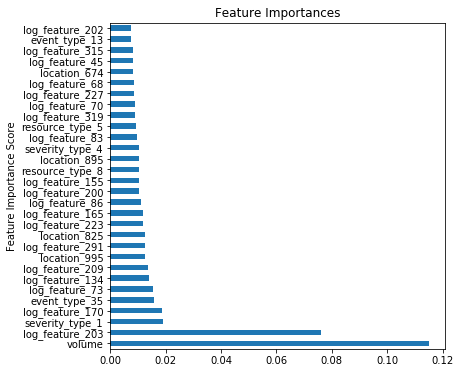


The default GradientBoostingClassifier has the following hyperparameters


```python
gbm0.get_params
```


    <bound method BaseEstimator.get_params of GradientBoostingClassifier(criterion='friedman_mse', init=None,
                  learning_rate=0.1, loss='deviance', max_depth=3,
                  max_features=None, max_leaf_nodes=None,
                  min_impurity_decrease=0.0, min_impurity_split=None,
                  min_samples_leaf=1, min_samples_split=2,
                  min_weight_fraction_leaf=0.0, n_estimators=100,
                  presort='auto', random_state=1, subsample=1.0, verbose=0,
                  warm_start=False)>


The array below is the probability of fault_0, fault_1, fault_2, for all IDs in the training set


```python
gbm0_predproba
```


    array([[ 0.45690216,  0.49524431,  0.04785353],
           [ 0.71503098,  0.27513577,  0.00983325],
           [ 0.5696948 ,  0.41977706,  0.01052814],
           ..., 
           [ 0.59814907,  0.36542972,  0.03642121],
           [ 0.92405098,  0.06897008,  0.00697894],
           [ 0.61622069,  0.34725127,  0.03652804]])


```python
predictors = [x for x in X.columns if x not in [target, 'id']]

parameters = {
#     'learning_rate':[0.1,0.05],
    'max_depth':[3,7,11],
    'min_samples_leaf':[3,9],
    'n_estimators':[100,500,1500],
    'subsample':[0.5,0.8]
}
grid = GridSearchCV(GradientBoostingClassifier(max_features='sqrt', random_state=1), parameters, scoring='accuracy', cv=3, n_jobs=-1)
grid.fit(dtrain[predictors], dtrain[target]) 
grid.grid_scores_, grid.best_params_, grid.best_score_
```

    /home/ephrim/anaconda3/lib/python3.6/site-packages/sklearn/model_selection/_search.py:761: DeprecationWarning: The grid_scores_ attribute was deprecated in version 0.18 in favor of the more elaborate cv_results_ attribute. The grid_scores_ attribute will not be available from 0.20
      DeprecationWarning)


    ([mean: 0.70831, std: 0.00194, params: {'max_depth': 3, 'min_samples_leaf': 3, 'n_estimators': 100, 'subsample': 0.5},
      mean: 0.71074, std: 0.00467, params: {'max_depth': 3, 'min_samples_leaf': 3, 'n_estimators': 100, 'subsample': 0.8},
      mean: 0.73283, std: 0.00365, params: {'max_depth': 3, 'min_samples_leaf': 3, 'n_estimators': 500, 'subsample': 0.5},
      mean: 0.73418, std: 0.00469, params: {'max_depth': 3, 'min_samples_leaf': 3, 'n_estimators': 500, 'subsample': 0.8},
      mean: 0.73337, std: 0.00431, params: {'max_depth': 3, 'min_samples_leaf': 3, 'n_estimators': 1500, 'subsample': 0.5},
      mean: 0.73459, std: 0.00306, params: {'max_depth': 3, 'min_samples_leaf': 3, 'n_estimators': 1500, 'subsample': 0.8},
      mean: 0.70681, std: 0.00391, params: {'max_depth': 3, 'min_samples_leaf': 9, 'n_estimators': 100, 'subsample': 0.5},
      mean: 0.70790, std: 0.00493, params: {'max_depth': 3, 'min_samples_leaf': 9, 'n_estimators': 100, 'subsample': 0.8},
      mean: 0.72917, std: 0.00282, params: {'max_depth': 3, 'min_samples_leaf': 9, 'n_estimators': 500, 'subsample': 0.5},
      mean: 0.73296, std: 0.00274, params: {'max_depth': 3, 'min_samples_leaf': 9, 'n_estimators': 500, 'subsample': 0.8},
      mean: 0.73120, std: 0.00367, params: {'max_depth': 3, 'min_samples_leaf': 9, 'n_estimators': 1500, 'subsample': 0.5},
      mean: 0.73323, std: 0.00475, params: {'max_depth': 3, 'min_samples_leaf': 9, 'n_estimators': 1500, 'subsample': 0.8},
      mean: 0.73337, std: 0.00212, params: {'max_depth': 7, 'min_samples_leaf': 3, 'n_estimators': 100, 'subsample': 0.5},
      mean: 0.73229, std: 0.00324, params: {'max_depth': 7, 'min_samples_leaf': 3, 'n_estimators': 100, 'subsample': 0.8},
      mean: 0.73486, std: 0.00465, params: {'max_depth': 7, 'min_samples_leaf': 3, 'n_estimators': 500, 'subsample': 0.5},
      mean: 0.73703, std: 0.00723, params: {'max_depth': 7, 'min_samples_leaf': 3, 'n_estimators': 500, 'subsample': 0.8},
      mean: 0.72958, std: 0.00557, params: {'max_depth': 7, 'min_samples_leaf': 3, 'n_estimators': 1500, 'subsample': 0.5},
      mean: 0.73323, std: 0.00590, params: {'max_depth': 7, 'min_samples_leaf': 3, 'n_estimators': 1500, 'subsample': 0.8},
      mean: 0.72389, std: 0.00347, params: {'max_depth': 7, 'min_samples_leaf': 9, 'n_estimators': 100, 'subsample': 0.5},
      mean: 0.72795, std: 0.00343, params: {'max_depth': 7, 'min_samples_leaf': 9, 'n_estimators': 100, 'subsample': 0.8},
      mean: 0.73337, std: 0.00151, params: {'max_depth': 7, 'min_samples_leaf': 9, 'n_estimators': 500, 'subsample': 0.5},
      mean: 0.73513, std: 0.00777, params: {'max_depth': 7, 'min_samples_leaf': 9, 'n_estimators': 500, 'subsample': 0.8},
      mean: 0.73594, std: 0.00449, params: {'max_depth': 7, 'min_samples_leaf': 9, 'n_estimators': 1500, 'subsample': 0.5},
      mean: 0.73689, std: 0.00596, params: {'max_depth': 7, 'min_samples_leaf': 9, 'n_estimators': 1500, 'subsample': 0.8},
      mean: 0.73527, std: 0.00076, params: {'max_depth': 11, 'min_samples_leaf': 3, 'n_estimators': 100, 'subsample': 0.5},
      mean: 0.73554, std: 0.00291, params: {'max_depth': 11, 'min_samples_leaf': 3, 'n_estimators': 100, 'subsample': 0.8},
      mean: 0.73784, std: 0.00673, params: {'max_depth': 11, 'min_samples_leaf': 3, 'n_estimators': 500, 'subsample': 0.5},
      mean: 0.73513, std: 0.00493, params: {'max_depth': 11, 'min_samples_leaf': 3, 'n_estimators': 500, 'subsample': 0.8},
      mean: 0.73323, std: 0.00255, params: {'max_depth': 11, 'min_samples_leaf': 3, 'n_estimators': 1500, 'subsample': 0.5},
      mean: 0.73310, std: 0.00207, params: {'max_depth': 11, 'min_samples_leaf': 3, 'n_estimators': 1500, 'subsample': 0.8},
      mean: 0.72985, std: 0.00465, params: {'max_depth': 11, 'min_samples_leaf': 9, 'n_estimators': 100, 'subsample': 0.5},
      mean: 0.73337, std: 0.00326, params: {'max_depth': 11, 'min_samples_leaf': 9, 'n_estimators': 100, 'subsample': 0.8},
      mean: 0.73323, std: 0.00273, params: {'max_depth': 11, 'min_samples_leaf': 9, 'n_estimators': 500, 'subsample': 0.5},
      mean: 0.73472, std: 0.00408, params: {'max_depth': 11, 'min_samples_leaf': 9, 'n_estimators': 500, 'subsample': 0.8},
      mean: 0.73581, std: 0.00279, params: {'max_depth': 11, 'min_samples_leaf': 9, 'n_estimators': 1500, 'subsample': 0.5},
      mean: 0.73269, std: 0.00368, params: {'max_depth': 11, 'min_samples_leaf': 9, 'n_estimators': 1500, 'subsample': 0.8}],
     {'max_depth': 11,
      'min_samples_leaf': 3,
      'n_estimators': 500,
      'subsample': 0.5},
     0.73784040102967074)


#### Inexhaustive (isn't it always?) GridSearch yields the following parameters likely to improve accuracy


```python
params = {
    'min_samples_leaf': 3,
    'subsample': 0.5,
    'max_depth': 11,
    'n_estimators': 500
}
```


```python
gbm1 = GradientBoostingClassifier(n_estimators=500, max_depth=11, subsample=0.5, min_samples_leaf=3,random_state=1)
gbm1_pred, gbm1_predproba  = modelfit(gbm1, dtrain, predictors, performCV=True, printFeatureImportance=True)
```

    
    Model Report
    Accuracy : 0.9163
    CV Score : Mean - 0.7268662 | Std - 0.0001046943 | Min - 0.7267182 | Max - 0.7269403


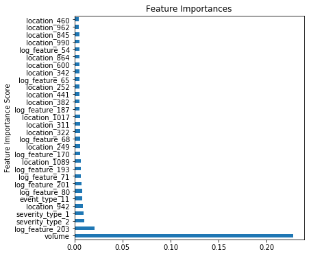


### Assess Model

######  Baseline GBC Accuracy


```python
metrics.accuracy_score(dtrain[target].values,gbm0_pred)
```


    0.75884026554667394


######  GridSearch Tuned GBC Accuracy


```python
metrics.accuracy_score(dtrain[target].values,gbm1_pred)
```


    0.91627150792575529


# Evaluation


```python
features_to_plot=20
```


```python
predictors = [x for x in X.columns if x not in [target,'id']]
```

Can compare feature importances for both the baseline model bgm0 and the gridsearch turned model gbm1


```python
feat_imp0 = pd.Series(gbm0.feature_importances_, predictors).sort_values(ascending=False)
feat_imp0.head(features_to_plot).plot(kind='barh', title='Feature Importances', figsize=(5,5))
plt.ylabel('Feature Importance Score')
```


    Text(0,0.5,'Feature Importance Score')


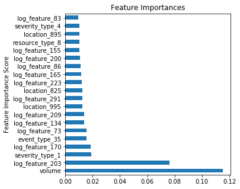


```python
feat_imp1 = pd.Series(gbm1.feature_importances_, predictors).sort_values(ascending=False)
feat_imp1.head(features_to_plot).plot(kind='barh', title='Feature Importances', figsize=(5,5))
plt.ylabel('Feature Importance Score')
```


    Text(0,0.5,'Feature Importance Score')


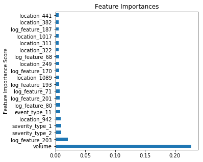


### Visualizing most influential parameters by category


```python
feature_list = ['log_feature','resource_type','location','severity_type','event_type']
feature_list_dict = {}
```


```python
# for feature in feature_list:
#     feature_list_dict[feature] = pd.DataFrame(feat_imp0[feat_imp0.index.str.startswith(feature)].values, feat_imp0[feat_imp0.index.str.startswith(feature)].index)

for feature in feature_list:
    feature_list_dict[feature] = pd.DataFrame(feat_imp1[feat_imp1.index.str.startswith(feature)].values, feat_imp1[feat_imp1.index.str.startswith(feature)].index)

```


```python
for feature in feature_list:
    feature_list_dict[feature].head(10).plot(kind='bar', title='Feature Importances', legend=None)
    plt.ylabel("Feature importance for " + feature)
    plt.xticks(rotation=90)
```


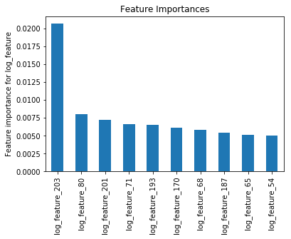


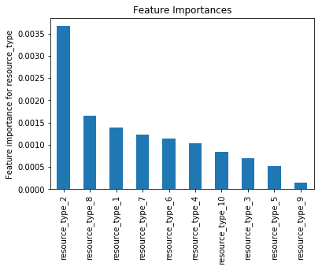


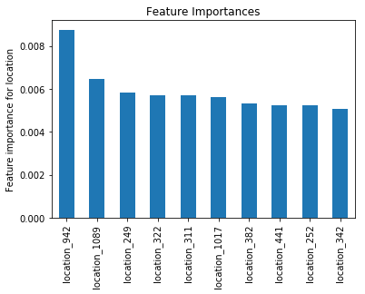


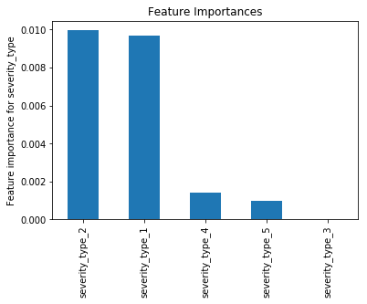


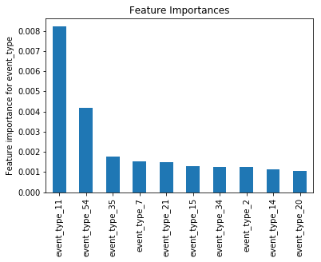


```python
prob_output = pd.DataFrame(gbm1_predproba, dtrain[target].index)
```


```python
prob_output.head()
```


<div>
<style>
    .dataframe thead tr:only-child th {
        text-align: right;
    }

    .dataframe thead th {
        text-align: left;
    }

    .dataframe tbody tr th {
        vertical-align: top;
    }
</style>
<table border="1" class="dataframe">
  <thead>
    <tr style="text-align: right;">
      <th></th>
      <th>0</th>
      <th>1</th>
      <th>2</th>
    </tr>
    <tr>
      <th>id</th>
      <th></th>
      <th></th>
      <th></th>
    </tr>
  </thead>
  <tbody>
    <tr>
      <th>1</th>
      <td>0.090888</td>
      <td>0.906753</td>
      <td>0.002359</td>
    </tr>
    <tr>
      <th>5</th>
      <td>0.736305</td>
      <td>0.261895</td>
      <td>0.001800</td>
    </tr>
    <tr>
      <th>6</th>
      <td>0.254204</td>
      <td>0.744550</td>
      <td>0.001246</td>
    </tr>
    <tr>
      <th>8</th>
      <td>0.975050</td>
      <td>0.024129</td>
      <td>0.000820</td>
    </tr>
    <tr>
      <th>13</th>
      <td>0.273052</td>
      <td>0.726185</td>
      <td>0.000763</td>
    </tr>
  </tbody>
</table>
</div>


#### Write out the model's probability predictions for Fault_2


```python
sorted_prob_output = pd.DataFrame(prob_output[2].sort_values(ascending=False))
```


```python
sorted_prob_output.to_csv('fault2proba.csv', index=True)
```
